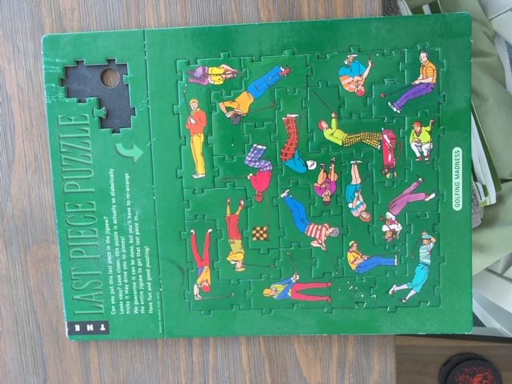

# "Golfing Madness" Puzzle Solver

## About the Puzzle

This is a solution I wrote in 2005 to a puzzle. It has my poorly-formed 2005 sense of humour in the comments and variable names.
This was very early after I had learned programming and I believe the first real-world problem I solved with a program.

*Golfing Madness* is a puzzle by Dugald Keith from the *Last Piece Puzzle* series. These puzzles look like a simple jigsaw puzzles at first glance,
but they are far, far more complex to solve than that. My mother had one in her shop, and not a single person had been able to solve it. I took this
as a challenge.

There are no obvious clues or indications that your working solution was on the right track. My initial attempts were on paper - I started recording a tree diagram of all the combinations I had tried in a
methodical approach, starting from the same space every time, and proceeding in the same order, such that I could eliminate combinations that didn't work
without inadvertently repeating them. Once the tree started to fill an entire sheet of A4 paper it became obvious that this was no simple puzzle, and
needed some serious computation.

I used my new knowledge of the C and C++ programming languages to encode the shape of the pieces, and their puzzle tabs. A loop then attempts a *brute-force* solution of combination of pieces.
I was also interested in discovering if there was more than one solution, so it runs through the entire problem space.
My first attempt took hours and hours to solve - which is how I first found out about `printf()` being rather slow inside loops.

It would be interesting to find out if there was some sort of heuristic that might work better, some visible pattern to look out for,
or if it was intended to be solved with a computer or by a mathematical proof of some sort.

It was, in any case, probably my first little victory in programming - I'd built a program that actually worked, and solved a problem I wasn't even sure could be solved.
I probably did a little jump when the solution popped out on the screen.

## Building the Code

`g++ GOLFMAIN31.CPP`

Then run the output executable from a terminal.

e.g. `.\a.exe`

## 2005 to 2020

I think my current code looks pretty similar to my 2005 code since the gap skips my crazy years in complex C++ land. I've returned to this kind of simple reasoning over data.
One obvious change is that in this code it looked like I'd just learned about *linked lists*. There's no need for that - these days I'd just pop the pieces into an array of pieces, possibly just with an extra boolean flag to avoid messing around with full and empty lists.

## Other Solutions

* https://github.com/mattrosstaylor/last_piece_puzzle
